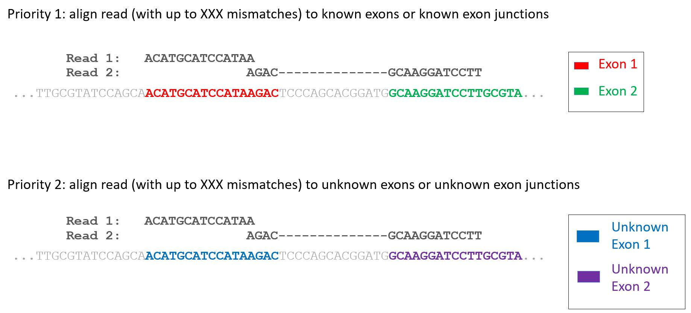

# RNA-Sequencing Read-Alignment Project
## Tiffany Chen and Nader Namini Asl
### CS176 (Fall 2018)

## Introduction
In this project, we have implemented some basic BWT functions that we covered in class, and then implemented a
simplified version of an aligner (what algorithm/method?) for RNA sequencing reads. 


## Rules and Tips

- You can find all required (skeleton) functions/classes/methods in `project.py`.  All the python files can be found in
`project.zip`; We have created and imported other files for helper functions. The util files are in the same directory
structure as `project.py`; Lastly, we included a brief write-up describing the approach we took for the project in
`write-up.pdf`.
- Python 3 was used to develop the project and only the libraries and modules that are provided by the default 
installation of Python, as well as numpy, have been used.
- The input and outputs of the functions are specific in the docstring for each function.
- A Jupyter Notebook was used for loading in the data and developing/evaluating our alignment algorithm. You can find
a working solution in the Python file `Algorithm.ipynb`.


## BWT Functions
### Rules and Tips
- The solutions are 0-indexed, and any intervals are [inclusive, exclusive).
- The algorithm was developed with the expectation that it will solely be tested on correctness on small or medium sized
examples (probably length < 10000). Our function do not time out unless it really takes too long to run.
- We assumed an alphabet consisting of `['$', 'A', 'C', 'T', 'G']`, where "$" will always only be the terminator.
- We assumed the `s` parameter in all the function is already terminated by "$".
- For constructing the suffix array, we did not implement the KS algorithm. From past experiences, the Python
implementation of KS was actually slow as hell (probably because of the Python overhead). We used naive sorting on
prefixes instead of radix sort. Our construction of the suffix array is efficient enough to use it for the aligner
part of the project. Also, when we use our function for the aligner, it does not use a radix of over 100 for sorting,
as we assume the memory usage is limited to something reasonable, not to mention that longer radixes take longer
to generate as well.
- Do not delete docstring for exact suffix matches if you want a sanity check of the code.

### Testing
We have provided a simple Python doctest as sanity check for the BWT functions. You can run this by running
```
python -m doctest project.py
```
on the command line.

### Functions
- __`get_suffix_array(s)`__<br>
Naive implementation of suffix array generation (0-indexed). This code is fast enough so we have enough time in
`Aligner.__init__` (see bottom).

    _Input:_
    - `s`: a string of the alphabet `['A', 'C', 'G', 'T']` already terminated by a unique delimiter '$'
    
    _Output:_
    - list of indices representing the suffix array
    ```
    >>> get_suffix_array('GATAGACA$')
    [8, 7, 5, 3, 1, 6, 4, 0, 2]
    ```
- __`get_bwt(s, sa)`__<br>
_Input:_
    - `s`: a string terminated by a unique delimiter '$'
    - `sa`: the suffix array of `s`
    
    _Output:_
    - `L`: BWT of `s` as a string

- __`get_F(L)`__<br>
_Input:_
    - `L = get_bwt(s)`
    
    _Output:_
    - `F`, first column in `Pi_sorted`

- __`get_M(F)`__<br>
Returns the helper data structure `M` (using the notation from class). `M` is a dictionary that maps character
strings to start indices. i.e. `M[c]` is the first occurrence of `"c"` in `F`.

    If a character `"c"` does not exist in `F`, we set `M[c] = -1`

- __`get_occ(L)`__<br>
Returns the helper data structure `OCC` (using the notation from class). `OCC` should be a dictionary that maps 
    string character to a list of integers. If `c` is a string character and `i` is an integer, then `OCC[c][i]` gives
    the number of occurrences of character `"c"` in the bwt string up to and including index `i`.
    
- __`exact_suffix_matches(p, M, occ)`__<br>
Find the positions within the suffix array sa of the longest possible suffix of `p` 
that is a substring of `s` (the original string).
    
    Note that such positions must be consecutive, so we want the range of positions.

    _Input:_
    - `p`: the pattern string
    - `M`, `occ`: buckets and repeats information used by `sp`, `ep`
    
    _Output:_
    - a tuple `(range, length)`
        - `range`: a tuple (start inclusive, end exclusive) of the indices in `sa` that contains
            the longest suffix of `p` as a prefix. `range=None` if no indices matches any suffix of `p`
        - `length`: length of the longest suffix of `p` found in `s`. `length=0` if no indices matches any suffix of `p`

        An example return value would be `((2, 5), 7)`. This means that `p[len(p) - 7 : len(p)]` is
        found in `s` and matches positions `2`, `3`, and `4` in the suffix array.

        ```
        >>> s = 'ACGT' * 10 + '$'
        >>> sa = get_suffix_array(s)
        >>> sa
        [40, 36, 32, 28, 24, 20, 16, 12, 8, 4, 0, 37, 33, 29, 25, 21, 17, 13, 9, 5, 1, 38, 34, 30, 26, 22, 18, 14, 10, 6, 2, 39, 35, 31, 27, 23, 19, 15, 11, 7, 3]
        >>> L = get_bwt(s, sa)
        >>> L
        'TTTTTTTTTT$AAAAAAAAAACCCCCCCCCCGGGGGGGGGG'
        >>> F = get_F(L)
        >>> F
        '$AAAAAAAAAACCCCCCCCCCGGGGGGGGGGTTTTTTTTTT'
        >>> M = get_M(F)
        >>> sorted(M.items())
        [('$', 0), ('A', 1), ('C', 11), ('G', 21), ('T', 31)]
        >>> occ = get_occ(L)
        >>> type(occ) == dict, type(occ['$']) == list, type(occ['$'][0]) == int
        (True, True, True)
        >>> occ['$']
        [0, 0, 0, 0, 0, 0, 0, 0, 0, 0, 1, 1, 1, 1, 1, 1, 1, 1, 1, 1, 1, 1, 1, 1, 1, 1, 1, 1, 1, 1, 1, 1, 1, 1, 1, 1, 1, 1, 1, 1, 1]
        >>> exact_suffix_matches('ACTGA', M, occ)
        ((1, 11), 1)
        >>> exact_suffix_matches('$', M, occ)
        ((0, 1), 1)
        >>> exact_suffix_matches('AA', M, occ)
        ((1, 11), 1)
        ```
        
## RNA Read Alignment
In this part of the project, we implemented some method to align RNA reads to genome. We are given a reduced size genome
of roughly 11 million bases with the location of genes, isoforms, and exons. We used an alignment technique discussed in
lecture 13 (TODO).

### Reads
Our reads are generated from the __transcriptome__ of the given genome. The given genome sequence corresponds to the
forward strand; We assumed the genes/isoforms/exons are all on the forward strand, and all reads match to the forward
strand. __There are no insertions or deletions__ (but there could be mismatches) in the reads (i.e. each position in the
read corresponds to some position in the genome). In addition, the genes/isoforms/exons that some reads are generated
from have been __hidden__, i.e. we assumed these "unknown" genes will not be passed to our Aligner class in 
`Aligner.__init__`. In addition, some reads could be randomly generated. We have not tested against being able to align
reads to the transcriptome if we are also not able to align these to the transcriptome. See 
[Evaluation/Scoring](#evaluationscoring) for more details on what we have been evaluated on. In any read generated from
the genome (visible or unknown), there are at most 6 mismatches, so any alignment with more than 6 mismatches is
invalid.

#### Tips
- __We only align to the forward strand__, i.e. match the read sequence to the genome sequence, there should be no need
to reverse complement anything.
- There is no insertion or deletion, so we do not output alignments with insertion or deletion.
- Ideally, we should first align the reads to the transcriptome then the genome.
- Implementing STAR, we assumeed minimum and maximum intron sizes to be 20 and 10000. We are using window sizes of 64000 bases
from the anchor for our implementation, but we might have used whatever worked best.

### `Aligner` Class
We implemented the `Aligner` class in `project.py`. It will be initialized with genome information, calling
`Aligner.align` on a number of sequences to get our outputs, we can, then, evaluate the outputs.

#### Initialization/Constructor
In `Aligner.__init__`, we are given the genome sequence as well as `genes`, which is a list of `Gene` container objects
that we have defined in `shared.py`. Each `Gene` contains a list of `Isoform` objects that correspond to the gene,
and each `Isoform` contains a list of `Exon` objects. You could look at how these classes are defined in the file,
but you cannot modify these classes.

#### Format of an Alignment
Since it has been specified that there is no insertion or deletion, an alignment of a read to the genome can be thought
as `k` (usually `k` will be 1 or 2) separate ungapped alignments between the read and the genome (with some start index
in the read and start index in the genome). Thus, we specified the alignment as a python list of `k` tuples of 
`(<read_start_index>, <genome_start_index>, <length>)`. For example, an alignment of `[(0, 2, 3), (3, 6, 10)]` specifies
that the 0th position of the read aligns to the 2nd position of the genome for 3 bases, and then the 3rd position of the
read aligns to the 6th positon of the genome for 10 bases. If we can’t find an alignment for a read, we return an empty
list, `[]`.

__Warning:__ if the ranges of two consecutive alignment pieces overlap in the read, i.e. if 
`<read_start_1> + <length_1> > <read_start_2>`, the second piece of the alignment will be discarded and the new 
alignment will be scored accordingly. This is checked for with the provided functions in `evaluation.py` (see
[Evaluation/Scoring](#evaluationscoring)).

### Test Files
We are given files containing examples of what kind of genome and read sequences our alignment might be tested on.
We parsed the files and tried our algorithm on these examples since they were representative of the evaluation set. 
- `genome.fa` is a FASTA file with the genome sequence.
- `reads.fa` is a FASTA files with read sequences. Note that the file does not include base quality (PHRED) scores, as
we have seen in the Bowtie1 algorithm. If we implemented Bowtie1, we can assume that the PHRED score is fixed for all
bases.
- `genes.tab` is a tab-separated file containing three types of rows:
    - a gene row begins with "gene" and specifies the `gene_id` then a semicolon-separated list of `isoform_id`
    - an isoform row begins with "isoform" and specifies the `isoform_id` then a sorted semicolon-separated list of
    `exon_id`
    - an exon row begins with "exon" and specifies the `exon_id`, `start`, and `end` of the exon.
    
    Moreover, the genomic elements that are "unknown" (hidden when the `Aligner` is tested) are prefixed with "unknown".
    If a gene is unknown, its corresponding isoforms and exons will also be marked as unknown. __We parse this file to
    construct our python set of genes that we feed into our `Aligner.__init__`__. We made sure to construct each `Gene`
    with all of its corresponding `Isoform` objects, and etc.
    
### Evaluation/Scoring
#### Alignment Prioritization
We __always__ prioritize aligning reads to known isoforms (in `genes.tab`) with 6 or less mismatches. Only if we can’t
align with 6 or less mismatches, we try to align reads to other parts of the genome with 6 or less mismatches (as these
regions may represent unknown genes; there are no genes with unknown exons). We also minimize the number of mismatches,
but do not choose an alignment to an unknown isoform with less mismatches over an alignment to a known isoform with
more mismatches (but still 6 or less).


If we don’t align some indices of a read, those indices will be counted as mismatches (so it’s always best to align all
indices of the read). Since there is no insertion or deletion, our alignment will be scored based on one-to-one and
__consecutive__ correspondence to the transcriptome. i.e. if we match a read to an isoform, we make sure that the
read aligns __consecutively__ to the transcript generated by concatenating the exons within the isoform, there are no
gaps when aligning to the transcriptome.

### `evaluation.py`
To make sure we are able to evaluate the aligner’s alignments, the function used to evaluate the alignments is provided
in `evaluation.py`. We, first, need to construct a python set of known `Isoform` and a python set of unknown `Isoform`
objects. We can, then, build an index by calling the `index_isoform_locations` function, and use this index to run 
`evaluate_alignment` on the alignment that we generate with `Aligner.align`.
#### Runtime Performance Requirement
For a 11 million base genome, our `Aligner.__init__` method takes less than 500 seconds to run. Our `Aligner.align`
method takes on average less than 0.5 seconds per read. In addition, we were penalized if our `Aligner.align` was
more than 2 times slower than the mean runtime of everyone in the class.

## Submission
This assignment was due on __Friday 11/16 11:59pm PST__. We created an Instructional account for CS 176 and submitted
our project there. Only one person per our pair submitted, but we both submitted as well just to be safe. We, each, 
indicated the name of our partner when prompted by Glookup. As stated above, __our submission keeps all required
(skeleton) functions/classes/methods in `project.py`__. All the python files can be found in `project.zip`; We have 
created and imported other files for helper functions. The util files are in the same directory structure as
`project.py`. We may, depending on the reason, have another chance to submit with a penalty if our first submission
crashes. Lastly, we included a brief write-up describing the approach we took for the project in `write-up.pdf`.

## Feedback
Once the assignment was graded, a scores table for all students was released, with the follow information:
- __SA__: Suffix array subscore based on correctness.
- __match__: Exact suffix match subscore. Exact suffix matches were graded on correctness.
- __alignment columns__: Alignments with a reference aligner and our solution were generated, then both evaluated. The
evaluations were either __gene__, __hidden_gene__, or __unaligned__. Let the rank of gene be 2, hidden_gene be 1, and
unaligned be 0. Then for each read our score was `[1 - 0.5 * (the aligner’s rank - our rank)]`. Notice we get extra
points if `our rank > the aligner's rank`.
    - __fake_alignment__: 75 totally random reads were generated. This column is an average our scores of those 75
    reads. Everyone has a score of 1 in this column because our rank and the actual rank were all 0 for all the reads,
    since nothing was aligned to the genome.
    - __gene_alignment__: There are 1420 reads that are from genes that are given. This column is an average of our
    score for those reads.
    - __hidden_gene_alignment__: There are 80 reads generated from genes that are hidden. This column is an average of
    our score for those reads. 0.6125 is a common score (for people who didn’t align against the genome) because the
    actual aligner aligns 75% of the reads that come from hidden genes (which are not in the transcriptome), and if we
    only aligned against against the transcriptome, we will align 0% of these reads.
    - __weighted_alignment__: This is equal to
    `0.75 * gene_alignment + 0.2 * hidden_gene_alignment + 0.05 * fake_alignment`
- __setup_time__: The amount of time it took to call `Aligner.__init__`. We got full credit if `our_time < 500 seconds`
- __correctness_score__:
`0.15 * SA + 0.15 * match + 0.5 * weighted_alignment + 0.1 * (setup_time_under_threshold) + 0.1 * (alignment_time_under_threshold)`
- __overall_score__: equal to `correctness_score` if we’re not late, else `0.85 * correctness_score`
    
